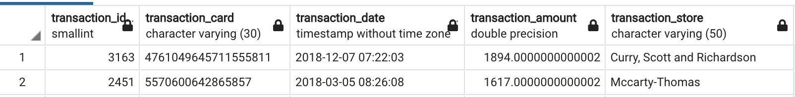
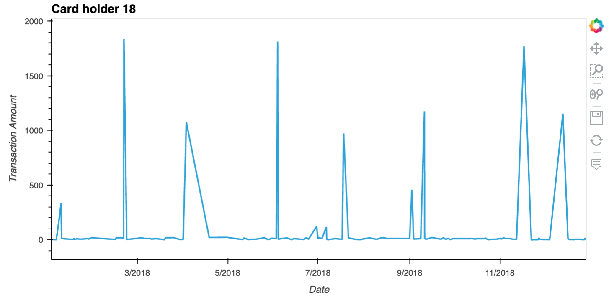
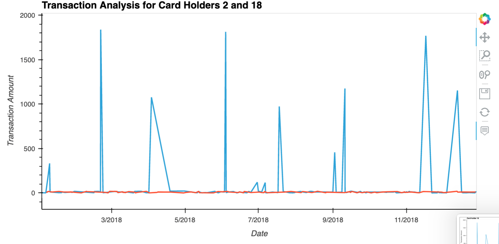
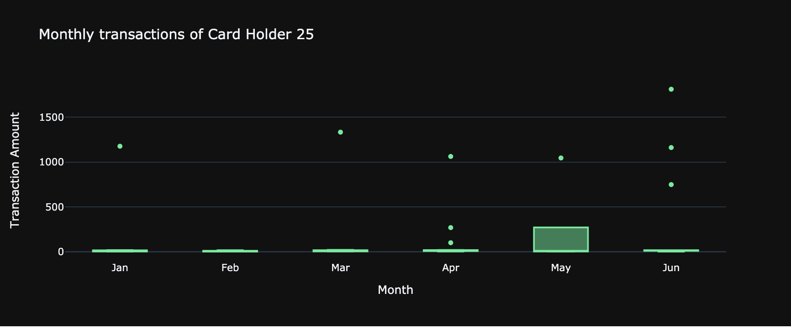

# SQL - Looking for Suspicious Transactions

##Takeaways:
There were many small transactions - under $2 -between the hours of 7am and 9am , but i din't find any evidence of hacking/fraud.
I did discover some outliers and anamolies. Here is the image for the anamoly found...

My charts didn't render on github. Following are the images of my charts as they appear in my pandas file:

